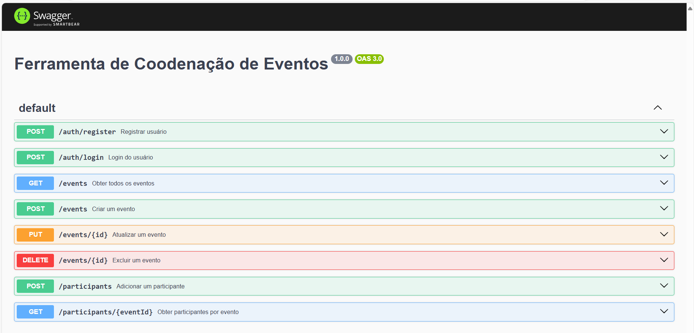
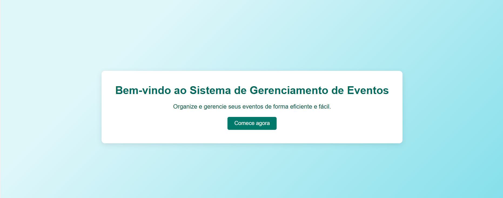
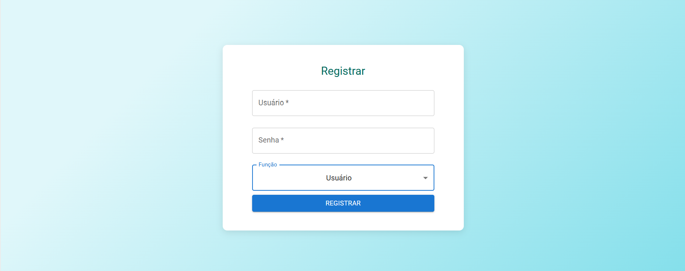
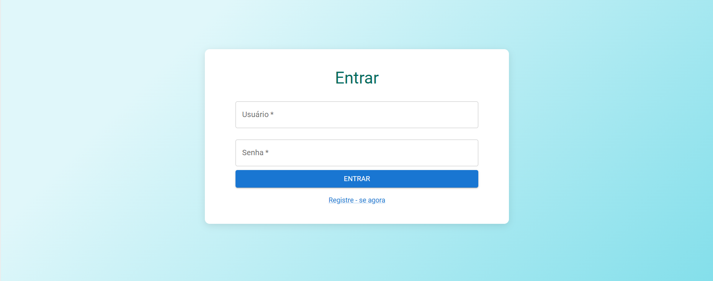

# Ferramenta de Coordenação de Eventos

 Este projeto é uma solução completa para gerenciamento de eventos, construída com tecnologias como Node.js, Express, e React. Ele oferece autenticação de usuários, operações CRUD para eventos, gerenciamento de participantes, e uma interface administrativa intuitiva.



## Recursos Principais

- **Autenticação e Autorização de Usuários:**
    - Registro e login de usuários utilizando JSON Web Tokens (JWT).
    - Middleware para proteger rotas que requerem autenticação.
    - Níveis de permissão para usuários comuns e administradores.

- **Operações CRUD para Eventos:**
    - Criação, leitura, atualização e exclusão de eventos.
    - Dados de eventos incluem título, descrição, data, local e organizador.
    - Validação de entrada de dados.

- **Gerenciamento de Participantes:**
    - Registro de usuários como participantes de eventos.
    - Interface para administradores visualizarem e gerenciarem participantes.

- **Integração com MongoDB:**
    - Armazenamento de informações em um banco de dados MongoDB.
    - Utilização do Mongoose para modelagem dos dados.

- **API RESTful:**
    - API RESTful para interações com o sistema através de endpoints claros.
    - Documentação da API utilizando Swagger.

- **Interface Administrativa com React:**
    - Interface para administração de eventos e participantes.
    - Consumo da API RESTful criada no backend.
    - Componentes para login, listagem, criação e edição de eventos, e gerenciamento de participantes.

- **Estilização e UX:**
    - Estilização dos componentes React utilizando CSS.
    - Interface responsiva para uma experiência de usuário agradável.

## Requisitos

- **Node.js** e **npm** devem estar instalados.
- Um servidor **MongoDB** em execução na máquina local ou em um servidor externo.

## Configuração e Uso

 Consulte o arquivo README.md em cada diretório específico (backend e frontend) para instruções detalhadas sobre configuração e uso.

## Documentação da API

   A documentação da API está disponível através da rota:
   ```
   http://localhost:5000/api-docs
   ```

### Frontend

1. **Instalando as Dependências:**
   Vá até o diretório `client` e execute o seguinte comando:
   ```
   npm install

2. **Configuração da Conexão com a API:**
   Renomeie o arquivo .env.example para .env e defina a variável REACT_APP_API_URL conforme abaixo:
   ```
   REACT_APP_API_URL=http://localhost:5000/api
   ```

3. **Iniciando o Frontend:**
   ```
   npm start
   ```
   Isso iniciará o frontend, que estará disponível em:
   ```
   http://localhost:3000
   ```

 ## Uso

 

 ### Login e Registro

1. **Registro:**
   Visite a rota de registro para criar um novo usuário. Existem permissões diferenciadas para usuários comuns e administradores. Para criar um administrador, defina o campo role como admin durante o registro do usuário.
   
   

2. **Login:**
   Utilize a rota de login para obter um token JWT com suas credenciais. Este token é necessário para acessar as rotas protegidas.

   

### Gerenciamento de Eventos

1. **Criar Eventos:**
   
 Utilize o formulário na interface de administração para adicionar novos eventos ao sistema.

2. **Listar Eventos:**
   A interface exibe todos os eventos disponíveis para visualização e gerenciamento.

3. **Editar e Excluir Eventos:**
   Utilize as opções fornecidas na lista de eventos para editar ou excluir eventos conforme necessário.

### Controle de Participantes

1. **Registrar como Participante:**
   Os participantes têm a possibilidade de se registrar para participar de eventos específicos.

2. **Gerenciar Participantes:**
   Os administradores têm o poder de visualizar e gerenciar a lista de participantes associados a cada evento.
## Estilização

 A estilização dos componentes React é feita através do uso de CSS no projeto. A interface foi cuidadosamente projetada para ser responsiva e proporcionar uma experiência de uso intuitiva em dispositivos de diferentes tamanhos.

 ## Vídeo no YouTube

 [](https://youtu.be/p-pZCnI83ac)


